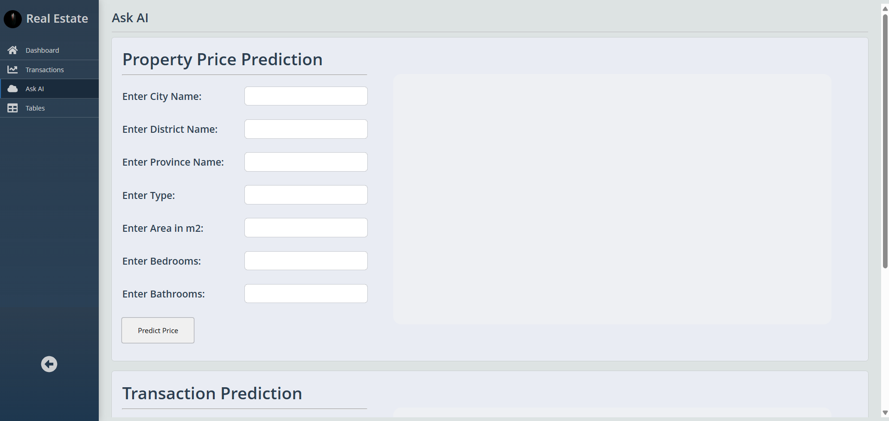

# Real Estate Dashboard & Prediction System

## Description

This project is an end-to-end dashboard system built with **React** (via **Vite**) for the frontend and **Quart** for the backend. It scrapes data from various websites, cleans and processes it, and stores it in a **Supabase** database. The frontend fetches the data via API calls and displays it using **Recharts.js**.

## Table of Contents

1. [Installation](#installation)
2. [Running the Backend](#running-the-backend)
3. [Running the Frontend](#running-the-frontend)
4. [Folder Structure](#folder-structure)
5. [Technologies Used](#technologies-used)
6. [License](#license)
7. [Contributors](#contributors)

## Screenshots




## Installation

### 1. Clone the Repository

First, clone the repository to your local machine:

```bash
git clone https://github.com/your-username/real-estate-dashboard.git
cd real-estate-dashboard
```

## Running the Backend

### **A. Install Dependencies**

1. Navigate to the `backend` directory:

   ```bash
   cd backend
   ```

2. Create and activate the virtual environment:

   ```bash
   python -m venv .venv  # Create a virtual environment
   .\.venv\Scripts\activate  # Activate the virtual environment (on Windows)
   ```

3. Install the required Python dependencies by using the requirements.txt:

   ```bash
   pip install -r requirements.txt
   ```

### **B. Configure the Environment Variables**

In the backend folder, create a .env file and add your Supabase credentials. Replace the placeholders with your actual credentials.

```bash
   SUPABASE_URL=your-supabase-url
   SUPABASE_KEY=your-supabase-key
```

### **C. Running the Backend Server**

After activating the virtual environment and installing dependencies, start the backend server using Hypercorn (the ASGI server):

```bash
   python -m hypercorn server:app
```

## Running the Frontend

### A. Install Dependencies

1. Navigate to the `src` directory (frontend):

   using npm:

   ```bash
   cd frontend/src
   ```

2. Install the required dependencies using npm or yarn:

   ```bash
   npm install
   ```

   This will install all necessary dependencies as specified in the package.json file for the frontend.

### B. Running the Frontend Server

Once the dependencies are installed, start the frontend development server using npm:

```bash
   npm run dev
```

The frontend will now be available at http://localhost:3000 (or the port specified in your .env file). Open this URL in your browser to see the real estate dashboard in action.

## Folder Structure

Here’s a high-level overview of the folder structure:

```plaintext
real-estate-dashboard/
├── backend/                   # Backend-related files
│   ├── .venv/                 # Virtual environment folder (inside backend)
│   ├── server.py              # Backend entry point (Quart app)
│   ├── scraping/              # Web scraping logic
│   ├── sorting/               # Data sorting and cleaning logic
│   ├── .env                   # Environment variables (Supabase URL & Key)
│   └── requirements.txt       # Python dependencies
├── src/                       # Frontend-related files (React + Vite)
│   ├── public/                # Public assets (index.html, etc.)
│   ├── src/                   # React app source code
│   ├── components/            # Reusable React components
│   ├── App.jsx                # Main React app file
│   ├── .env                   # Frontend environment variables
│   └── package.json           # Node.js dependencies
└── README.md                  # Project documentation (this file)
```

## Technologies Used

### 1. Backend

- **Quart**: A Python web framework for building asynchronous web apps. It is the core framework used for the backend server and API.
- **Python**: The backend is built using Python for its powerful web scraping, data processing, and API functionalities.
- **Supabase**: An open-source Firebase alternative that provides a backend-as-a-service solution. It is used for database management and authentication.
- **Requests**: A simple HTTP library used for web scraping to fetch data from external websites.

### 2. Machine Learning:

- **LightGBM (LGBM)** – Gradient boosting framework for training models
- **XGBoost (XGB)** – Extreme Gradient Boosting for price prediction
- **Scikit-Learn** – Used for preprocessing, model evaluation, and feature engineering

### 3. Frontend

- **React**: A JavaScript library for building user interfaces, used to create the frontend of the dashboard.
- **Vite**: A build tool that provides a fast and optimized development environment for React apps.
- **Recharts**: A charting library for React used to display various visualizations such as graphs and data plots.

### 4. Development Tools

- **Git**: A version control system used to manage the project’s source code and collaboration.

### 5. Database

- **Supabase Database**: A PostgreSQL database managed by Supabase, used to store and retrieve the data scraped and processed by the backend.

### 6. Other Tools

- **npm/yarn**: Package managers used to install and manage frontend dependencies for the React app.
- **Python Virtual Environment**: Used for isolating and managing Python dependencies for the backend server.

## License

This project is licensed under the MIT License - see the [LICENSE](LICENSE) file for details.

This open-source project is available for anyone to use, modify, and distribute freely under the MIT License.

## Contributors

We would like to thank the following contributors who have helped make this project possible:

- **Mostafa Dawi** – _Building Data Pipelines, Back-end & Front-end_ – [GitHub Profile Link](https://github.com/MostafaDawi)
- **Amanda Makdessi** – _Data Scraping & Cleaning_ – [GitHub Profile Link](https://github.com/amandamakdessi)
- **Yusuf Mazloum** – _Insights Extraction & Data Scraping_ – [GitHub Profile Link](https://github.com/Yusf4)
- **Mohammad Rahal** – _Data Scraping & ML models training_

If you'd like to contribute to this project, feel free to fork the repository, make changes, and submit a pull request!

### How to Contribute

1. Fork the repository.
2. Create a new branch (`git checkout -b feature-name`).
3. Commit your changes (`git commit -am 'Add new feature'`).
4. Push to the branch (`git push origin feature-name`).
5. Open a pull request to the main repository.
